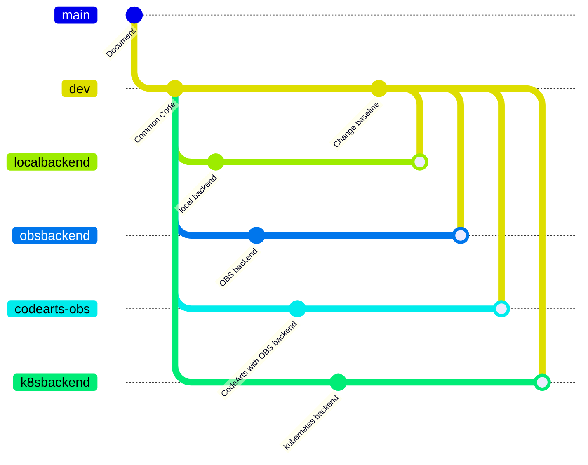
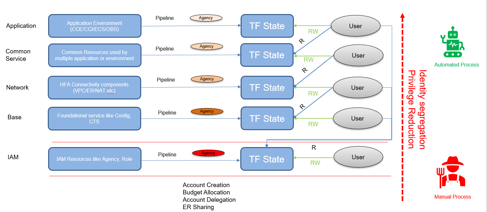

# HFA Reference Architecture Implementation Workshop

HFA is a well-architected, multi-account Huawei Cloud foundation environment in which you can deploy workloads and applications with confidence in security and infrastructure. It provides a baseline that covers multiple design areas including multi-account architecture, identity and access management, governance, data security, network design, and logging.

HFA follows key design principles across different design areas which accommodate all application portfolios and enable application migration, modernization, and innovation at scale.

This repository contains terraform codes and guidance for implementing the minimum HFA solution. It's also the standard base upon which you can build your customized HFA.

# Target Audience

We expect that you are familiar with Huawei Cloud and Terraform to get started but it's not mandatory.
* Architects - wanting to learn the implementation patterns for HFA on Huawei Cloud
* Site Reliability Engineer/Platform Engineer/DevOps Engineer - wanting to learn how to build their HFA from scratch
* Developers - interested in integrating business application in HFA

# Prerequisites
Before we start, we will need to ensure that we have some tools installed in your environment.
* Terraform
* VS Code
* git

# Limitations
Master account in HFA is mainly for billing、budget allocation and HFA environment initialization purpose and there aren't enough Huawei Cloud accounts for the workshop hosted by Huawei Cloud Professional Service Team for APAC, so the workshop excludes the master/main account settings. it only initializes the following accounts in HFA:
* Cloud Resource Management Account
* Common Services Account
* Transit Account
* Security Account
* Production Account

:high_brightness: In HFA, the master account also needs to be initialized to implement security baseline and delegate some organization responsibilities to other accounts, Please refer to the following documents to setup the master account

# Workshop Options
This workshop may be run in either a hosted or self-service mode. Please following the guidance below according to your situation to setup the environment.

## Hosted Event
At an Huawei Cloud hosted event you will be provided with temporary accounts. If you are participating the workshop at a hosted event with a facilitator, you will be provided with several Huawei Cloud accounts and its credentials to access the environment. In order to reduce the time needed to setup the execution environment, you will also be provided with a linux user name and password to access a standard environment with necessary tools installed to complete this workshop.

Please refer to the [guidance](./vscode_remote_server.md) to get started

## Self-Service Option
In self-service mode, you will deploy the workshop materials to your own accounts. you need five Huawei cloud accounts to complete this workshop.

# Repository Structure
This workshop is divided to multiple levels according to the complexity, every level is corresponding to a different branch. The table below describes  every branch in use in this workshop, you can choose the one that fits your business requirements to start exploring.

| Branch Name | Highlight | Applicable Scenario | Playbook |
| ----------- | --------- | --------------------| ---------|
| main | Only provides documents for this repository | / | / |
| dev  | for developments purpose, can not run directly because there is backend and data source configuration | development purpose | / |
| localbackend | Using local backend, prone to state disruption | test purpose only | [Local Backend](./localbackend.md) |
| obsbackend | OBS bucket is used as remote backend | production ready but use with caution | [OBS Backend](./obsbackend.md) |
| codearts-obs | OBS bucket is used as remote backend CodeArts is used to orchestrate the provisioning process | High level maturity on DevOps | [CodeArts with OBS Backend](./codearts-obs.md) |
| k8sbackend | Kubernetes is used as remote backend | there is Kubernetes cluster in-place | [Kubernetes Backend](./k8sbackend.md) |

All the code changes that are irrelevant to backend configuration are made in `dev` branch and merged to other branches except main branch.

# HFA Terraform Implementation Introduction
Implementing all HFA elements with Terraform at this stage is not possible because of service limitations. we follow the hierarchy below to implement HFA on Huawei Cloud.

By adopting the hierarchy, the complex enterprise environment is isolated into different terraform state files. Different level will use different credential that only can access the relevant state file and assume designated agency. In principal, Every level in this hierarchy can only write to the state file corresponding to this level but can read the state file one level down and the bottom level state file. But currently we may need to read state file from multiple underlying level due to the incomplete API support from certain services but the principle is that the dependencies on terraform state file are always top-down.

The current HFA implementation hierarchy only contains four level, but it cloud be expanded to more levels to meet customer scenario. And it is also possible that one level contains multiple state file for different purpose, like at application level, we may prefer splitting it into multiple state file by services or application to meet agile development requirements.
 
The reference implementation contains multiple modules that are corresponding to the hierarchy, the following table describe this relationship
| Module                | Hierarchy   |
|-----------------------|-------------|
| HFA-IAM               | IAM         |
| HFA-Base              | Base        |
| HFA-Network           | Network     |
| HFA-Network-workloads | Network     |
| HFA-App               | Application |
| HFA-Integration       | Application |

`HFA-Network` and `HFA-Network-worklaods` are using the same credential but will write to different state file to avoid state file corruption. The splitting of network resources is the result of lacking API support from relevant network services. Before we can apply configurations in `HFA-Network-worklaods`, we need to do some manual configurations from console like sharing ER in the `Transit Account` with other member accounts that need a vpc network. In the future, if the APIs are available, we can merge the two different modules into one.

The reason that why `HFA-Integration` exists is that the HFA adopts the centralized traffic control approach on network design. Application team usually doesn't has the permission to change network configuration so we need a additional level to do the job, and the job is the responsibility of network team or security team depends on how the traffic is controlled.