# Huawei Foundation Architecture Terraform Implementation Reference

> [!IMPORTANT]
> A real HFA is much more complicated than this, You need to talk to your customer to understand their specific business requirements and technology constraints to design the actual HFA for them.  

## Introduction
This implementation relies on OBS bucket as the backend storage for Terraform, Terraform currenlty needs to rely on S3 backend plugin to communicate with S3-Compatible object storage and does not accept new backend contribution. The drawback of this solution is that state-locking is not possible with OBS, if you need state-locking feature of Terraform, you need to use other backend. 

This workshop also demonstrates how to apply Terraform configuration through CodeArts Pipeline, with the integration of CodeArts Pipeline, we can reduce the possibility of exposing AK/SK unintentionally, there is only 1 AK/SK needed to create Agent for the pipeline, all the terraform excutions will get the credentials through ECS Agency.

## Building HFA with CodeArts and Terraform

### Get AK/SK in Cloud Resource Management Account
1. Log in to `Cloud Resource Management` with provided root credential 
2. On Huawei Cloud console, Click account name and Select `My Credentials`
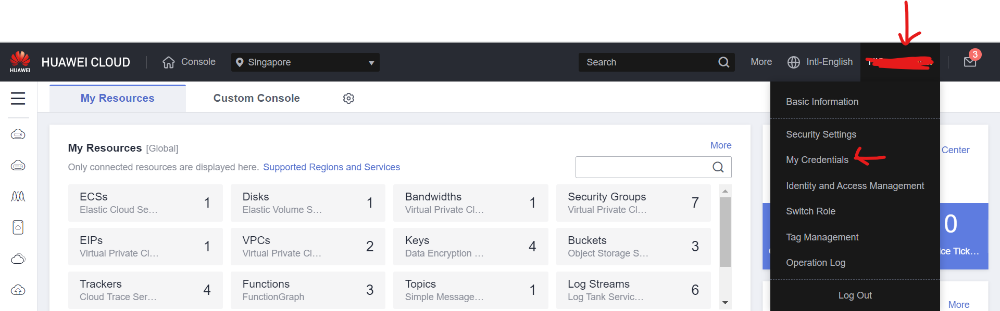 
3. on `My Credentials` page, Select `Access Keys`
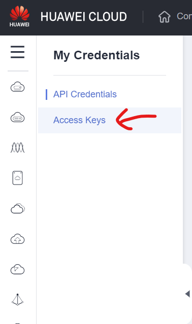
4. Create a new pair of AK/SK for current user and keep it for future use
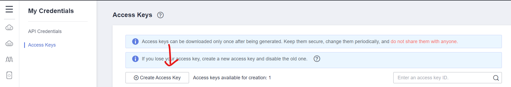

> [!IMPORTANT]
> Downloaded credentials should be safely kept

### Create CodeArts project in Cloud Resource Management Account
1. Log in to `Cloud Resource Management` with provided root credential 
2. On Huawei Cloud console, select `Service List` on the left side pannel and search `CodeArts`, select `CodeArts` service.
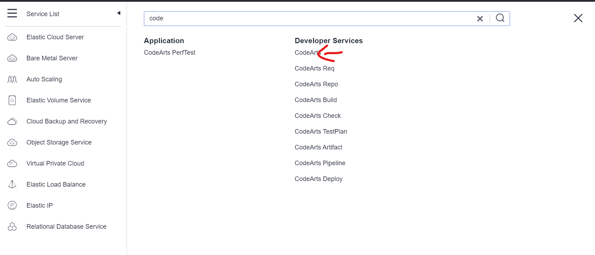
3. On the `CodeArts` page, Select `Access Service`
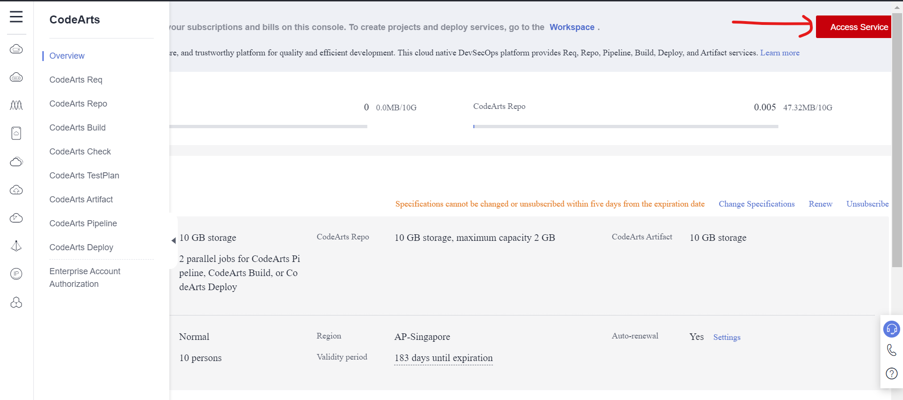
4. On the `CodeArts` service page, click `Create Project`
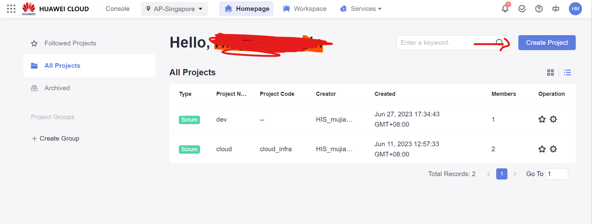
5. On the `Create Project` page, select `New` and create `hfa` project
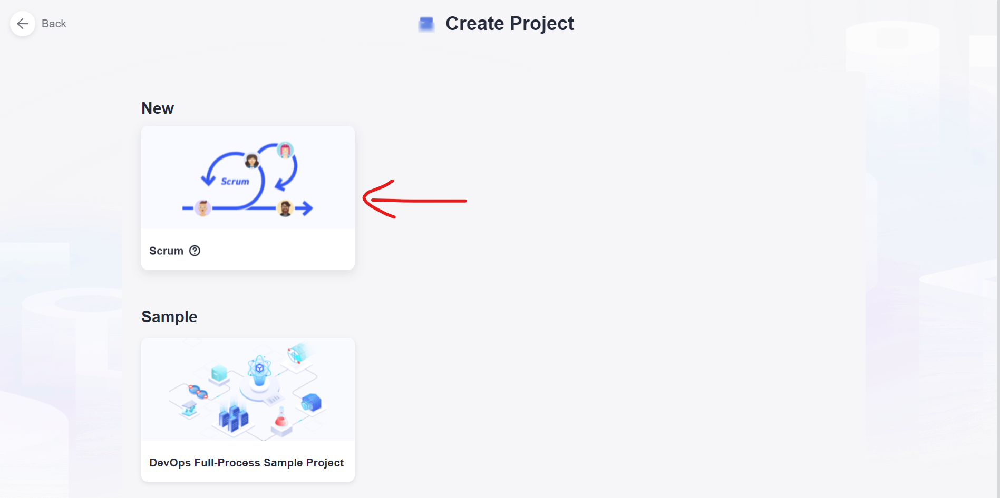
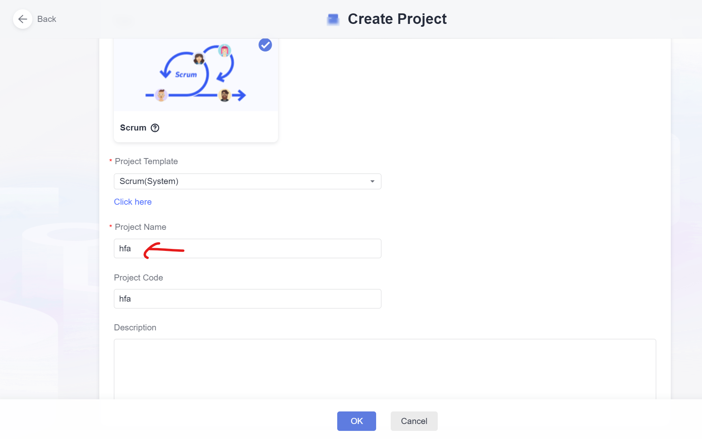
6. On the upper left corner of `CodeArts` page, click the account icon and select `All Account Settings`
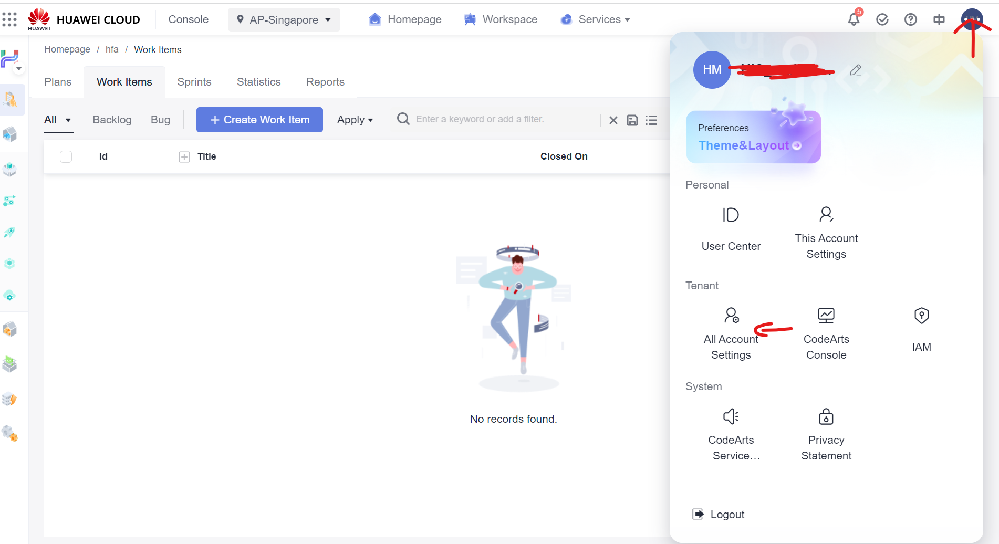
7. On the configuration page, select `Agent Pool` and Click `Create Pool`
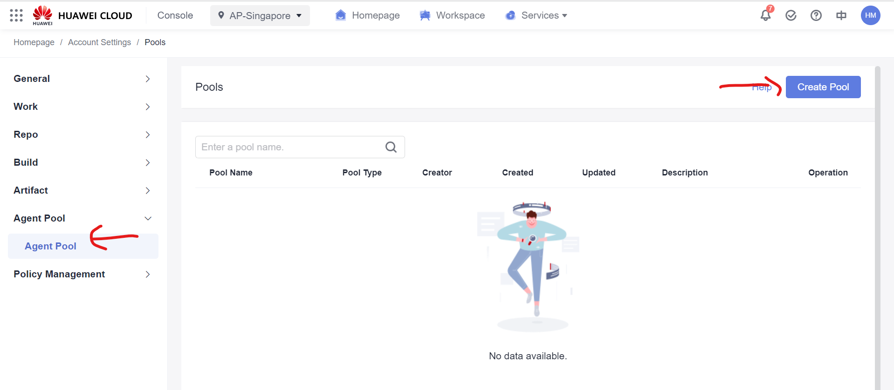
8. Provide the following parameters for the agent pool
* `Pool Name`: `hfa`
* `Pool Type`: `Linux`
* `This pool can be used by all users of the current account.`: :white_check_mark:
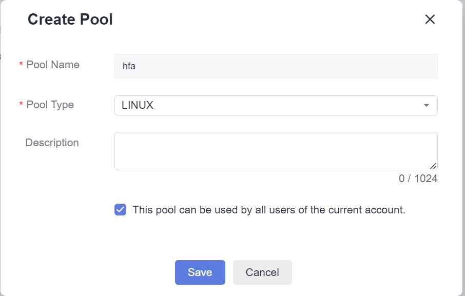
9. Click the configuration button on the newly created agent pool
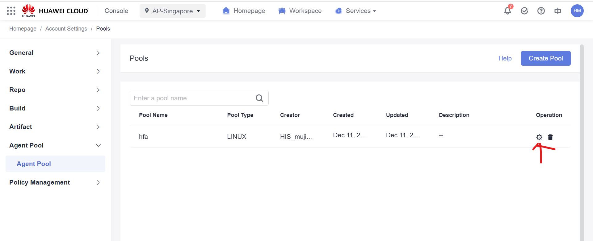
10. On the agent page, click `Create Agent`
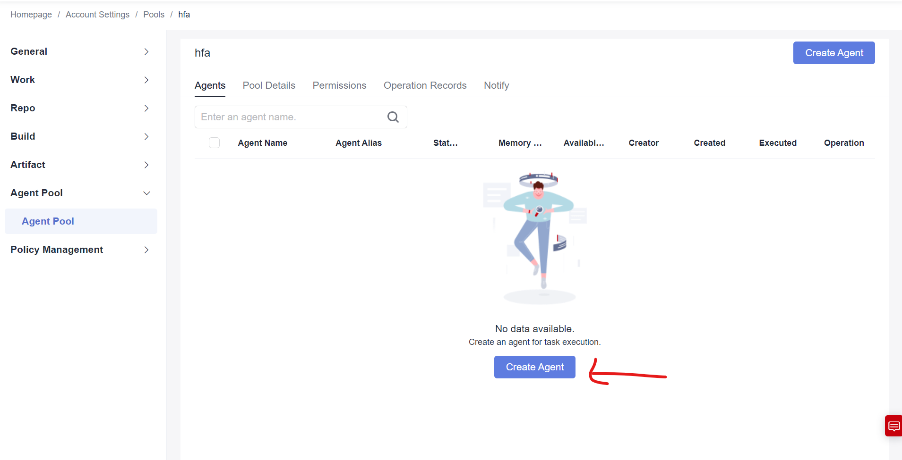
11. On the pop-up page, provide the AK/SK created in [last step](#get-aksk-in-cloud-resource-management-account) and change the parameters as the picture below shows
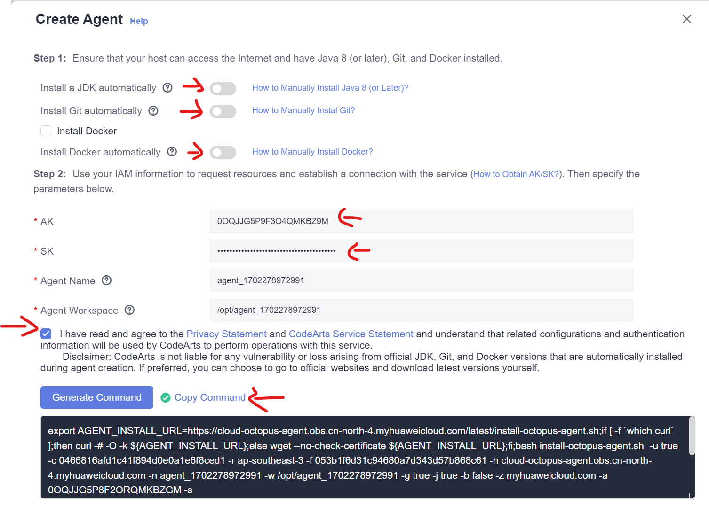
12. Click `Generate Command` and `Copy Command` to save the command in your text file for future use

### 