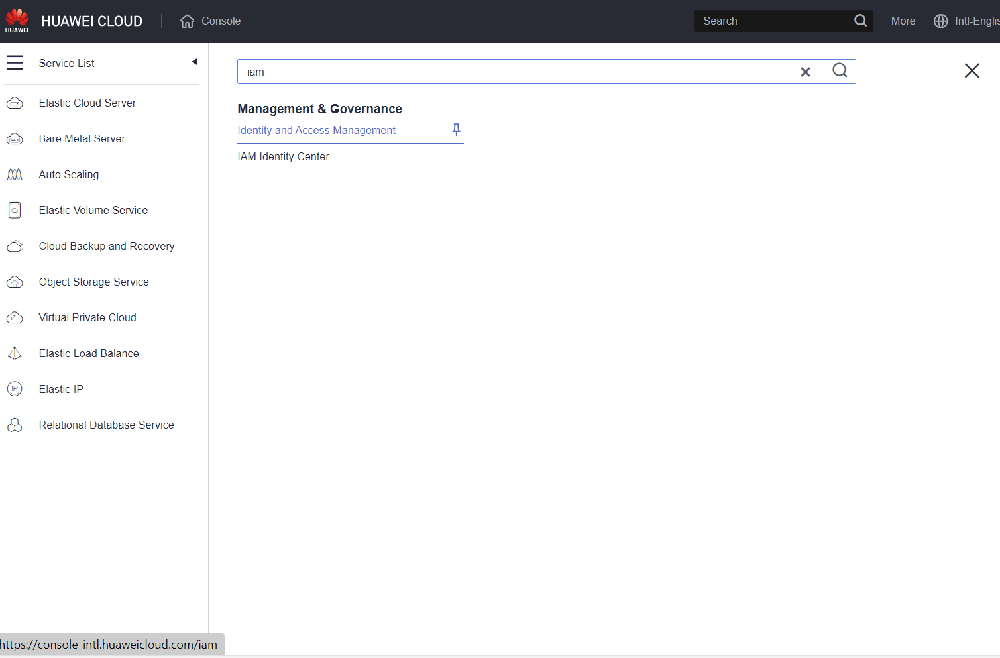
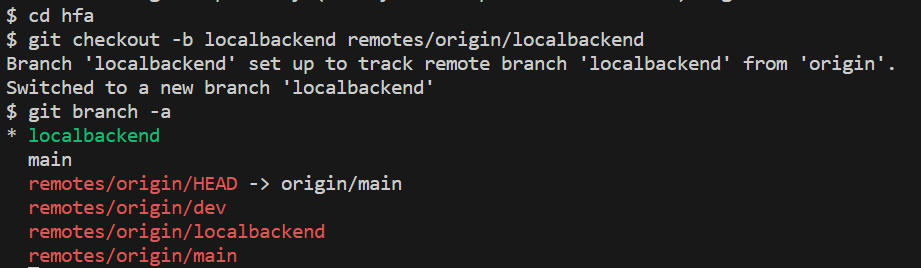

# Huawei Foundation Architecture Terraform Implementation Reference

> [!IMPORTANT]
> A real HFA is much more complicated than this, You need to talk to your customer to understand their specific business requirements and technology constraints to design the actual HFA for them.  

## Introduction
This is the basic HFA implementation which relies on Terraform local storage backend to minimize the terraform configuration.

> [!CAUTION]
> Do not use local storage backend in **Production Environment**

## Prerequisite

You need to have the following software installed on your laptop     
* Visual Studio Code
* Terraform (For the workshop hosted by Huawei Cloud Professional Service, a Linux environment with Terraform installed will be provided)

## Connect to Terraform Execution Environment
All the steps should be executed on remote server if you participates a workshop hosted by Huawei Cloud Professional service team, Please setup your local environment by following the setup guide.

[VS Code Setup](./vscode_remote_server.md)

## Building HFA with Terraform

### Create IAM User in Central IAM Account
1. Log in to `Central IAM Account` with provided root credential 
2. On Huawei Cloud console, select `Service List` on the left side pannel and search `iam`, select `Identity and Access Management` service.  

3. On `IAM` service page, select `User Groups` on the left side pannel and Click `Create User Group` to create `hfa_terraform` user group.


4. Select `hfa_terraform` user group and Click `Authorize` to assign `Security Administrator` and `Agent Operator` role to the group


5. On `IAM` service page, select `Users` on the left side pannel and Click `Create User` to create `hfa_terraform` user. This user belongs to `hfa_terraform` user group


> [!IMPORTANT]
> Downloaded credentials should be safely kept

### Clone HFA workshop repository

1. Clone the repository with following command
```
git clone https://github.com/Huawei-APAC-Professional-Services/hfa.git
```


2.  checkout the `localbackend` branch and check you are working on `localbackend` branch with the following command
```
cd hfa
git checkout -b localbackend remotes/origin/localbackend
git branch -a
```


3. In VS Code, Select `File` icon on the upper left corner


4. Select `Open Folder` and select the repo directory `hfa`


### Provisioning IAM Resources

1. Open the `HFA-IAM/terraform.tfvars` file in VS Code and change the value according to your environment.

2. Get the AK/SK from [Create IAM User in Central IAM Account](#create-iam-user-in-central-iam-account) and Set the environment variables with the following command
```
export HW_ACCESS_KEY="anaccesskey"
export HW_SECRET_KEY="asecretkey"
export HW_REGION_NAME="ap-southeast-3"
```  


3. Make sure you are in `hfa` directory in the terminal
```
pwd
```

4. Execute the following command to initialize the terraform
```
terraform -chdir=HFA-IAM/ init
```


5. Execute the following command to format and validate the `HFA-IAM` configuration, if there is any errors raised, you need to solve the error to continue the workshop
```
terraform -chdir=HFA-IAM/ validate
```

6. Execute the following command to apply the `HFA-IAM` configuration, when you are prompted to provide confirmation, type `yes`
```
terraform -chdir=HFA-IAM/ apply
```


### Provisioning HFA Base Resources

1. Make sure you are in `hfa` directory in the terminal
```
pwd
```
2. Execute the following command to format and validate the `HFA-Base` configuration, if there is any errors raised, you need to solve the error to continue the workshop
```
terraform -chdir=HFA-Base/ init
terraform -chdir=HFA-Base/ validate
```
3. Execute the following command to apply the `HFA-Base` configuration, when you are prompted to provide confirmation, type `yes`
```
terraform -chdir=HFA-Base/ apply
```

### Provisioning HFA Network Resources in Transit Account
1. Make sure you are in `hfa` directory in the terminal
```
pwd
```
2. Execute the following command to format and validate the `HFA-Network` configuration, if there is any errors raised, you need to solve the error to continue the workshop
```
terraform -chdir=HFA-Network/ init
terraform -chdir=HFA-Network/ validate
```
3. Execute the following command to apply the `HFA-Network` configuration, when you are prompted to provide confirmation, type `yes`
```
terraform -chdir=HFA-Network/ apply
```
4. Execute the following commands to get the account id of `Application Account` and `Common Account`

```
terraform -chdir=HFA-IAM/ output hfa_app_account_id
terraform -chdir=HFA-IAM/ output hfa_common_account_id
```

5. Log in to `Transit Account` and Search `Enterprise Router` service through `Service List` on the left side pannel


6. On the ER service page, Click `Manage Sharing`


7. Sharing the ER with `Application Account` and `Common Account` through the account ID you get in step 4.


### Provisioning HFA Network Resources in Member Account
1. Make sure you are in `hfa` directory in the terminal
```
pwd
```

2. Execute the following command to format and validate the `HFA-Network-workloads` configuration, if there is any errors raised, you need to solve the error to continue the workshop
```
terraform -chdir=HFA-Network-workloads/ init
terraform -chdir=HFA-Network-workloads/ validate
```
3. Execute the following command to apply the `HFA-Network-workloads` configuration, when you are prompted to provide confirmation, type `yes`
```
terraform -chdir=HFA-Network-workloads/ apply
```

### Provisioning HFA Application Resources in Application Account
1. Make sure you are in `hfa` directory in the terminal
```
pwd
```

2. Execute the following command to format and validate the `HFA-App` configuration, if there is any errors raised, you need to solve the error to continue the workshop
```
terraform -chdir=HFA-App/ init
terraform -chdir=HFA-App/ validate
```
3. Execute the following command to apply the `HFA-App` configuration, when you are prompted to provide confirmation, type `yes`
```
terraform -chdir=HFA-App/ apply
```

### Integrating Application with HFA in Application Account
1. Make sure you are in `hfa` directory in the terminal
```
pwd
```

2. Execute the following command to format and validate the `HFA-Integration` configuration, if there is any errors raised, you need to solve the error to continue the workshop
```
terraform -chdir=HFA-Integration/ init
terraform -chdir=HFA-Integration/ validate
```
3. Execute the following command to apply the `HFA-Integration` configuration, when you are prompted to provide confirmation, type `yes`
```
terraform -chdir=HFA-Integration/ apply
```

4. Once the configuration is applied, you will get terraform output `nginx_access_address`, you can access this address to see if it works


## Destroy workshop environment
After you have completed the testing, you can help to delete all resources created by this workshop, this is the east way to clean up.

1. Make sure you are in `hfa` directory in the terminal
```
pwd
```
2. Execute the following commands to delete all the resources created during the workshop
```
terraform -chdir=HFA-Integration/ destroy
terraform -chdir=HFA-App/ destroy
terraform -chdir=HFA-Network-workloads/ destroy
terraform -chdir=HFA-Network/ destroy
terraform -chdir=HFA-Base/ destroy
terraform -chdir=HFA-IAM/ destroy
```