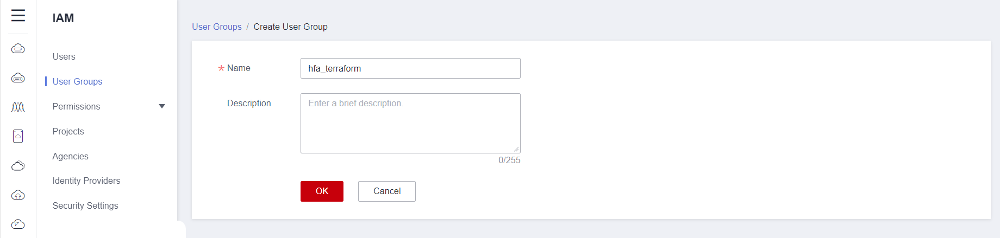
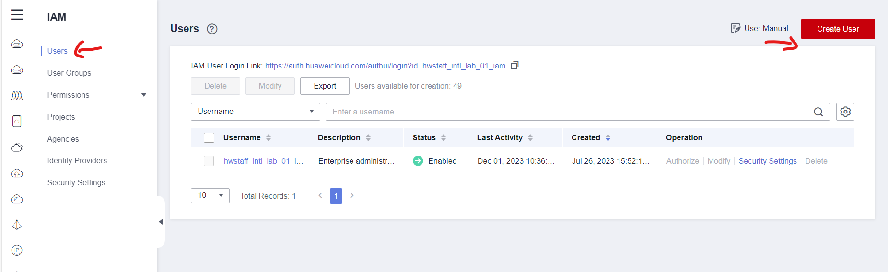
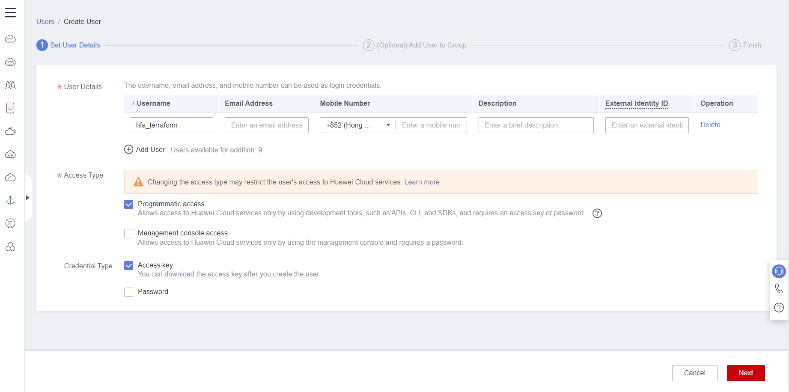
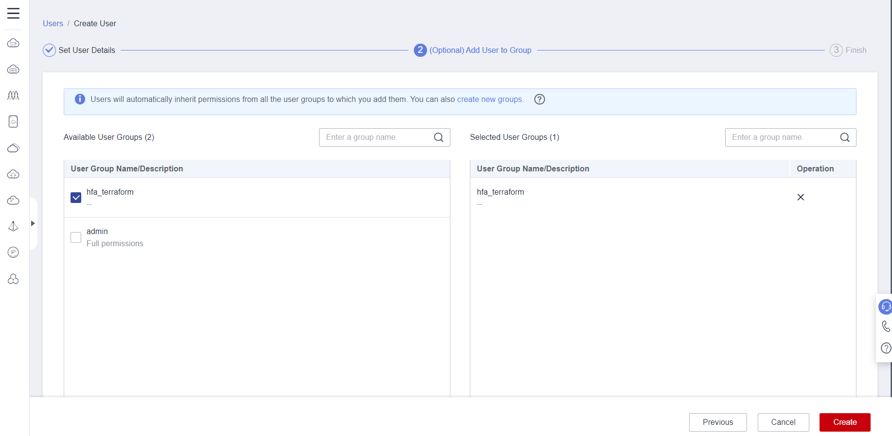
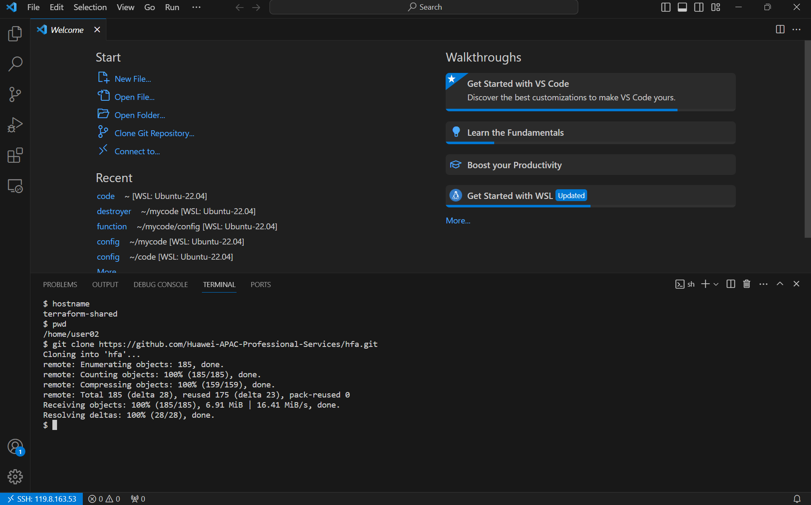
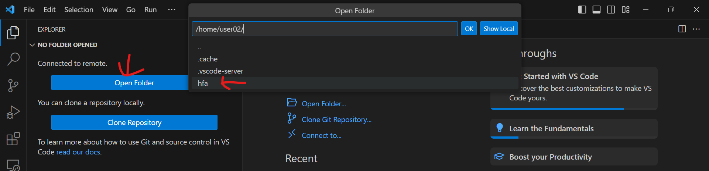
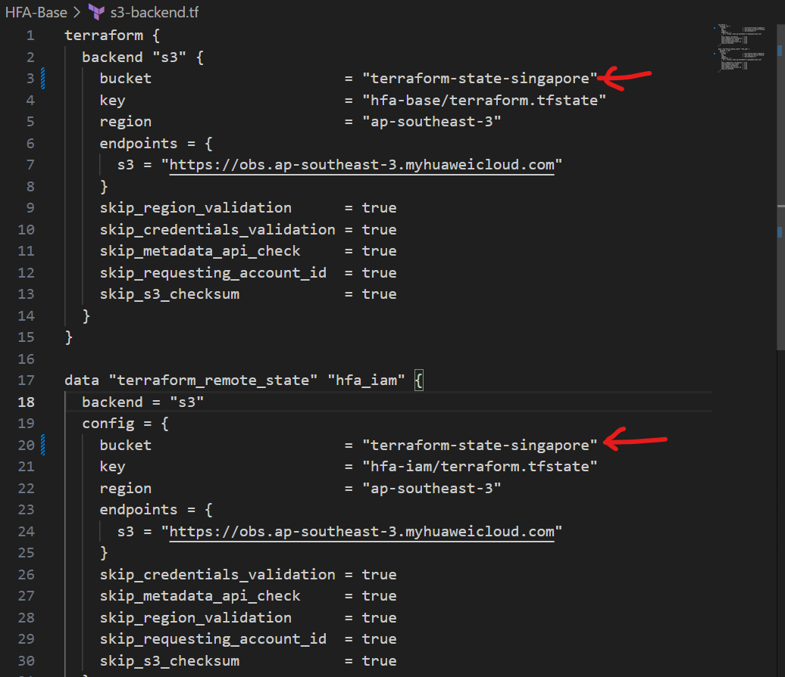
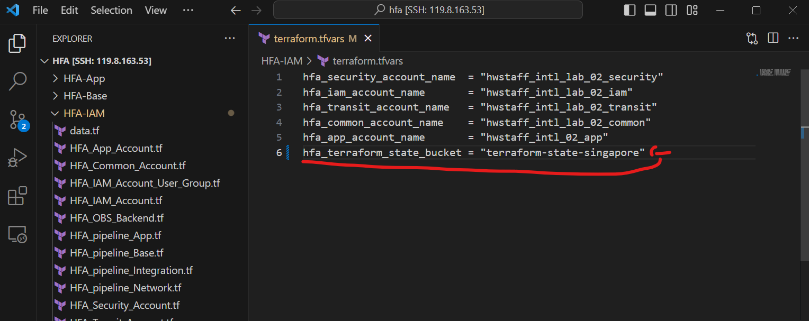

# Huawei Foundation Architecture Terraform Implementation Reference

> [!IMPORTANT]
> A real HFA is much more complicated than this, You need to talk to your customer to understand their specific business requirements and technology constraints to design the actual HFA for them.  

## Introduction
This implementation relies on OBS bucket as the backend storage for Terraform, Terraform currenlty needs to rely on S3 backend plugin to communicate with S3-Compatible object storage and does not accept new backend contribution. The drawback of this solution is that state-locking is not possible with OBS, if you need state-locking feature of Terraform, you need to use other backend. 

## Prerequisite

You need to have the following software installed on your laptop     
* Visual Studio Code
* Terraform (For the workshop hosted by Huawei Cloud Professional Service, a Linux environment with Terraform installed will be provided)

## Connect to Terraform Execution Environment
All the steps should be executed on remote server if you participates a workshop hosted by Huawei Cloud Professional service team, Please setup your local environment by following the setup guide.

[VS Code Setup](./vscode_remote_server.md)

## Building HFA with Terraform

### Create OBS bucket in Central IAM Account
1. Log in to `Central IAM Account` 
2. Select `Object Storage Service` from `Service List` on the left side of Huawei Cloud console. 

3. Select `Create Bucket` on the upper right corner of the console

4. Provide the following necessary parameters to create the bucket
* `Region`: `AP-Singapore`
* `Bucket Name`: Choose any name as you like
* `Data Redundancy Policy`: `Multi-AZ storage`
* `Default Storage Class`: `Standard`
* `Bucket Policies`: `Private`
* `Server-Side Encryption`: `SSE-KMS`
* `Encryption Key Type`: `Default`


### Create IAM User in Central IAM Account
1. Log in to `Central IAM Account` with provided root credential 
2. On Huawei Cloud console, select `Service List` on the left side pannel and search `iam`, select `Identity and Access Management` service.  


3. On `IAM` service page, select `Permissions` -> `Policies/Roles` on the left side pannel and Click `Create Custom Policy` to create `hfa_terraform_kms` policy with following policy statement.
```
{
    "Version": "1.1",
    "Statement": [
        {
            "Effect": "Allow",
            "Action": [
                "kms:dek:encrypt",
                "kms:cmk:getMaterial",
                "kms:cmk:create",
                "kms:grant:retire",
                "kms:cmk:getRotation",
                "kms:cmkTag:create",
                "kms:cmk:decrypt",
                "kms:partition:create",
                "kms:cmk:update",
                "kms:cmk:get",
                "kms:dek:create",
                "kms:partition:list",
                "kms:partition:get",
                "kms:grant:revoke",
                "kms:cmk:encrypt",
                "kms:cmk:getQuota",
                "kms:cmk:list",
                "kms:cmk:getInstance",
                "kms:cmk:generate",
                "kms:cmk:verify",
                "kms:cmk:crypto",
                "kms:cmk:sign",
                "kms:dek:crypto",
                "kms:dek:decrypt",
                "kms:grant:create",
                "kms:grant:list",
                "kms:cmk:deleteMaterial",
                "kms:cmk:getPublicKey",
                "kms:cmkTag:list",
                "kms:cmk:enable"
            ]
        }
    ]
}
```


4. On `IAM` service page, select `Permissions` -> `Policies/Roles` on the left side pannel and Click `Create Custom Policy` to create `hfa_terraform_obs` policy with following policy statement. you need to change `BucketName` according to your environment.
```
{
    "Statement": [
        {
            "Action": [
                "iam:agencies:*",
                "iam:tokens:assume",
                "iam:groups:*",
                "iam:credentials:*",
                "iam:identityProviders:*",
                "iam:mfa:*",
                "iam:permissions:*",
                "iam:projects:*",
                "iam:quotas:*",
                "iam:roles:*",
                "iam:policies:*",
                "iam:users:*",
                "iam:securitypolicies:*"
            ],
            "Effect": "Allow"
        },
        {
            "Effect": "Allow",
            "Action": [
                "obs:object:GetObject",
                "obs:object:DeleteObject",
                "obs:object:PutObject",
                "obs:object:ModifyObjectMetaData",
                "obs:object:GetObjectVersion"
            ],
            "Resource": [
                // Change the BucketName to the one you created in previous step
                "OBS:*:*:object:BucketName/*"
            ]
        },
        {
            "Action": [
                "obs:bucket:HeadBucket",
                "obs:bucket:ListBucket"
            ],
            "Effect": "Allow",
            "Resource": [
                // Change the BucketName to the one you created in previous step
                "OBS:*:*:bucket:BucketName"
            ]
        }
    ],
    "Version": "1.1"
}
```
5. On `IAM` service page, select `User Groups` on the left side pannel and Click `Create User Group` to create `hfa_terraform` user group.




6. Select `hfa_terraform` user group and Click `Authorize` to assign `Security Administrator`,`hfa_terraform_kms` and `hfa_terraform_obs` roles to the group

7. On `IAM` service page, select `Users` on the left side pannel and Click `Create User` to create `hfa_terraform` user. This user belongs to `hfa_terraform` user group





> [!IMPORTANT]
> Downloaded credentials should be safely kept

### Clone HFA workshop repository

1. Clone the repository with following command
```
git clone https://github.com/Huawei-APAC-Professional-Services/hfa.git
```


2.  checkout the `obsbackend` branch and check you are working on `obsbackend` branch with the following command
```
cd hfa
git checkout -b obsbackend remotes/origin/obsbackend
git branch -a
```


3. In VS Code, Select `File` icon on the upper left corner


4. Select `Open Folder` and select the repo directory `hfa`


### Provisioning IAM Resources

1. Open the `HFA-IAM/terraform.tfvars` file in VS Code and change the value according to your environment.

2. Get the AK/SK from [Create IAM User in Central IAM Account](#create-iam-user-in-central-iam-account) and Set the environment variables with the following command
```
export AWS_ACCESS_KEY_ID="anaccesskey"
export AWS_SECRET_ACCESS_KEY="asecretkey"
export AWS_DEFAULT_REGION="ap-southeast-3"
export HW_ACCESS_KEY="anaccesskey"
export HW_SECRET_KEY="asecretkey"
export HW_REGION_NAME="ap-southeast-3"
```  

3. Open `HFA-IAM/obs.tfbackend` in  VS Code and change the `bucket` parameter to the one you created in [Create OBS bucket in Central IAM Account](#create-obs-bucket-in-central-iam-account)


4. Open `HFA-IAM/terraform.tfvars` in VS Code and change the `hfa_terraform_state_bucket` parameter to the one you created in [Create OBS bucket in Central IAM Account](#create-obs-bucket-in-central-iam-account)


5. Execute the following commands to init and validate the configurations
```
terraform -chdir=HFA-IAM/ init -backend-config="obs.tfbackend"
terraform -chdir=HFA-IAM/ validate
```

6. Execute the following commands to apply the terraform configuration
```
terraform -chdir=HFA-IAM/ apply
```

### Provisioning HFA Base Resources

1. Make sure you are in `hfa` directory in the terminal
```
pwd
```

2. Execute the following command to format and validate the `HFA-Base` configuration, if there is any errors raised, you need to solve the error to continue the workshop
```
terraform -chdir=HFA-Base/ init
terraform -chdir=HFA-Base/ validate
```
3. Execute the following command to apply the `HFA-Base` configuration, when you are prompted to provide confirmation, type `yes`
```
terraform -chdir=HFA-Base/ apply
```