# Configure VS Code
This article guides you to configure VS Code to connect to remote Linux server.

## Install Remote Development Kit
1. In VS Code, Select `Mange` icon on the lower left corner then Select `Extensions`
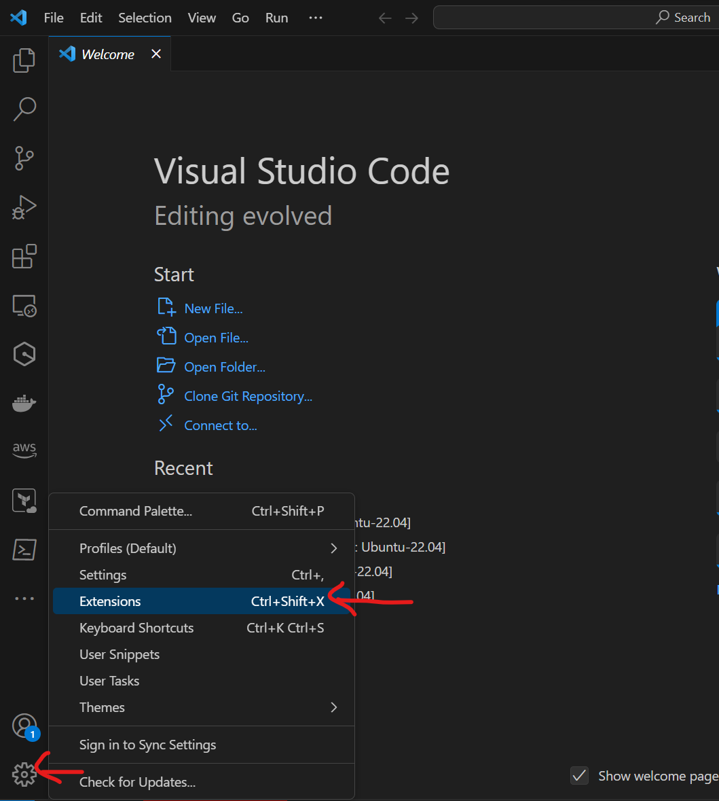  

2. In the VS Code marketplace, search `Remote Development` and install the extension if it's not installed
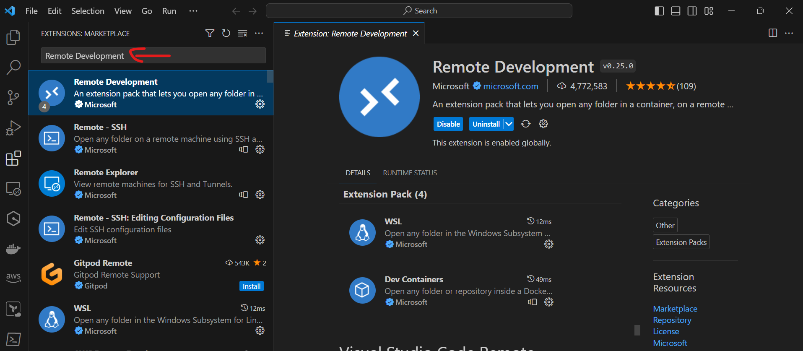

## Connect to remote server

1. In VS Code, on the left pannel, Select the `Remote Explorer` icon
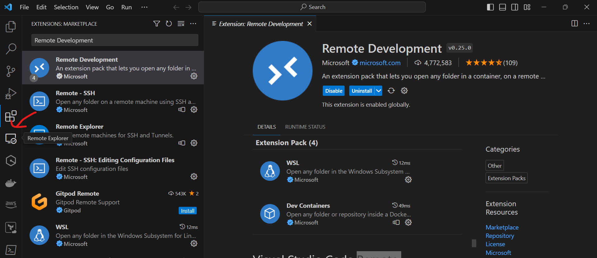 

2. In VS Code, Select `Remotes(Tunnels/SSH)` from `REMOTE EXPLORER` and Select `+` on the `SSH` tab
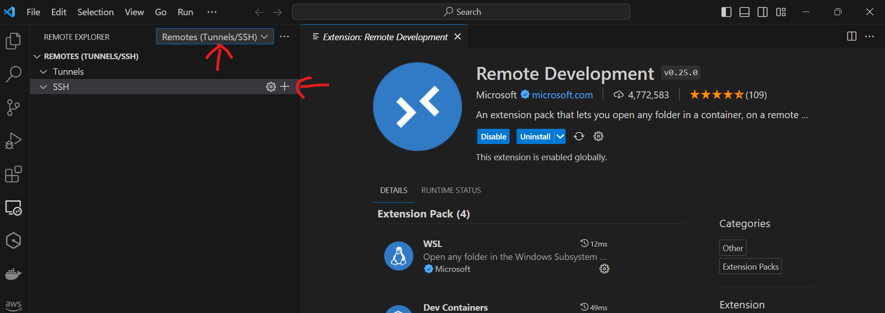

3. VS Code will prompt you to provide the login information as the following picture shows
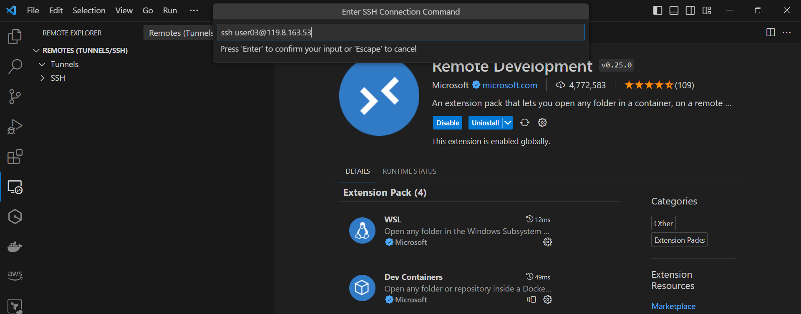

> [!NOTE]
> Please use the user name and server information provided by facilitator

4. After the server information is provided, you need to select one of the SSH configuration file to keep the server information
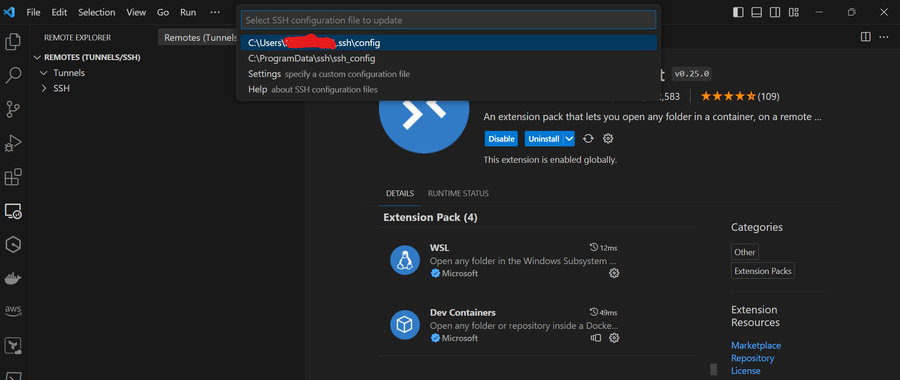

5. After you chose the configruation file, you will be prompted on the lower right corner of VS Code, Select `Connect` to connect to remote server.
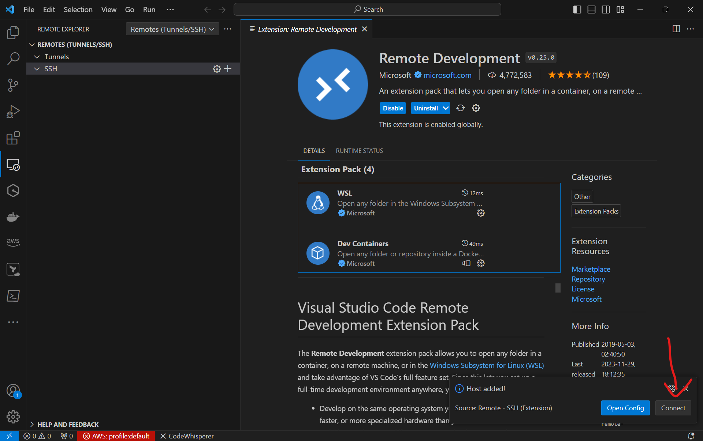

6. On the new window, you will encounter several prompts, provide necessary information to finish the setup as following picture shows
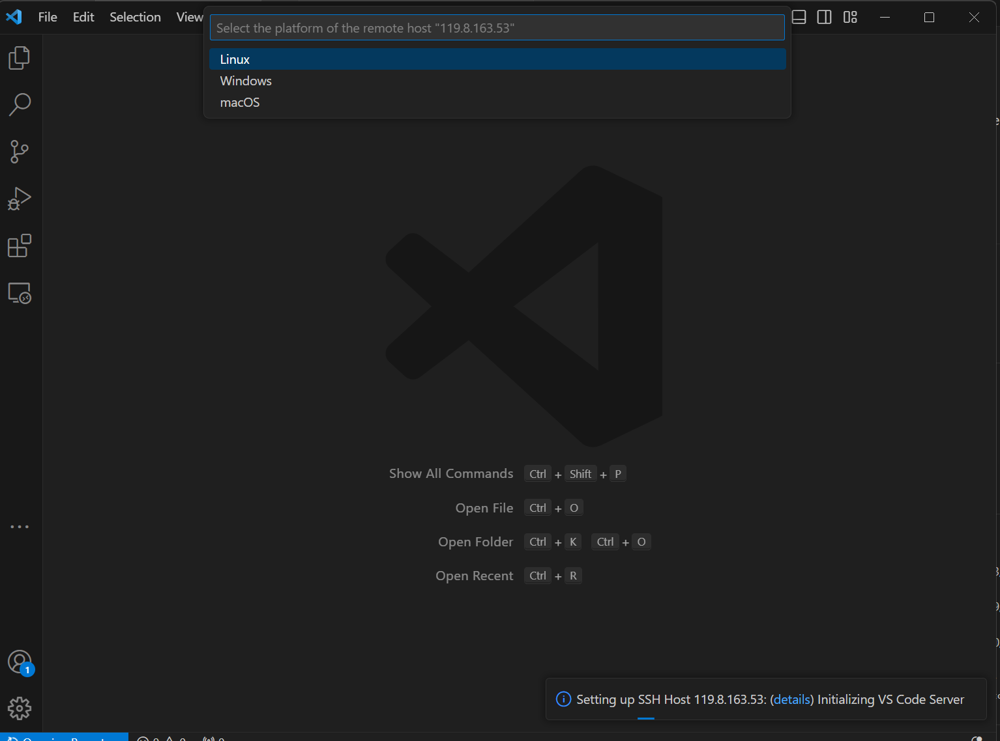

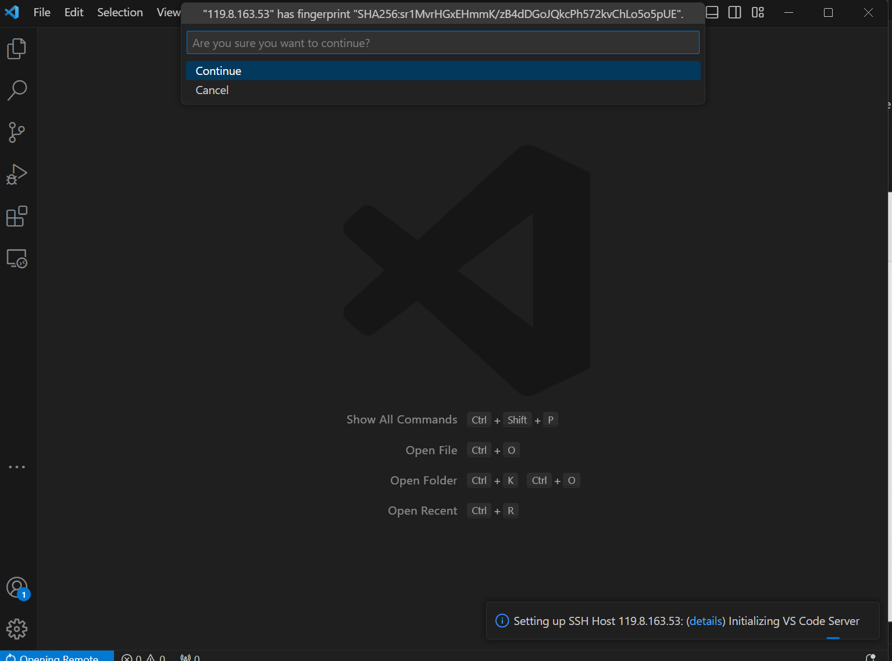

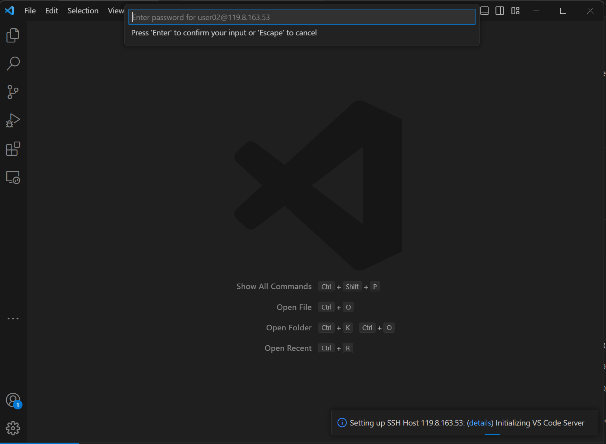

8. After the setup is done, you should be able to open a new terminal and execute command on remote server as following picture show

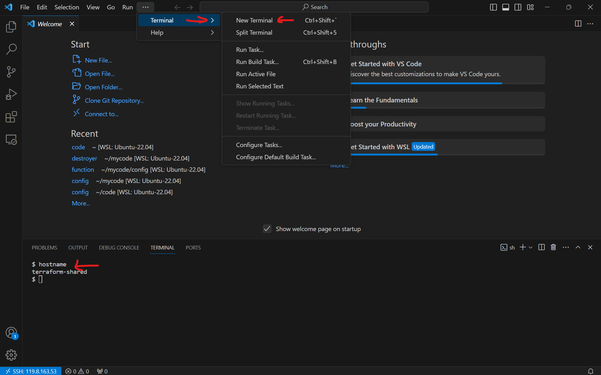

